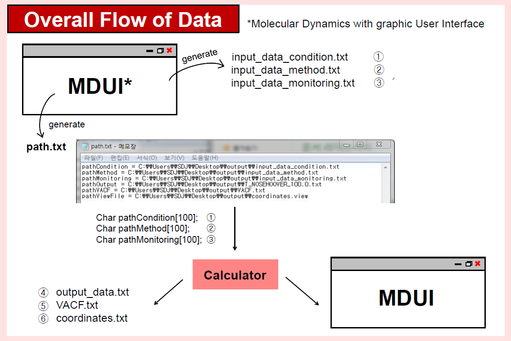

# MDUI
MDUI (**M**olecular **D**ynamics with graphic **U**ser **I**nterface) is a from-scratch molecular dynamics (MD) program with graphic user interface (GUI). The MD executable, and graphic user interface (GUI) code and executable for the MD are included in this repository. These code and executables were made for the purpose of study when I was an undergraduate student. [See the demonstration here.](MDUI_demonstration.avi)

 

## Key Executables
[link to executables](executables/)
- `MDUI.exe`: This runs the GUI for C-based MD code made on my own. The Java source codes for the GUI are included in `source_codes`.
  
  
 

  

- `md_my_simulation_autocorr.exe` (C): This is a LJ (Lennard-Jones) potential-based MD calculator which was written in C.

- `MoleculeViewer.exe` (C++): This is a molecular visualizer made by Dr. Sangwon Lee at LG Chem when he was in a master's course. It was written in C++. 

  
 

## Poster for MDUI

 

