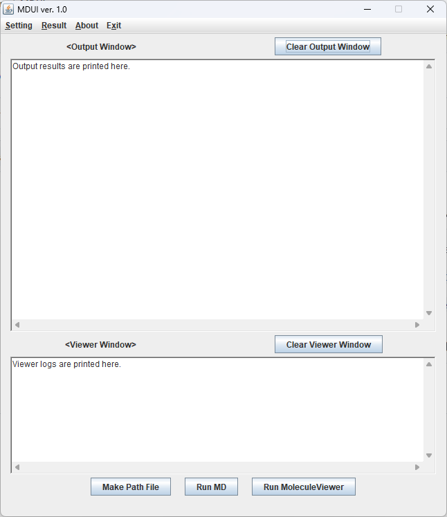
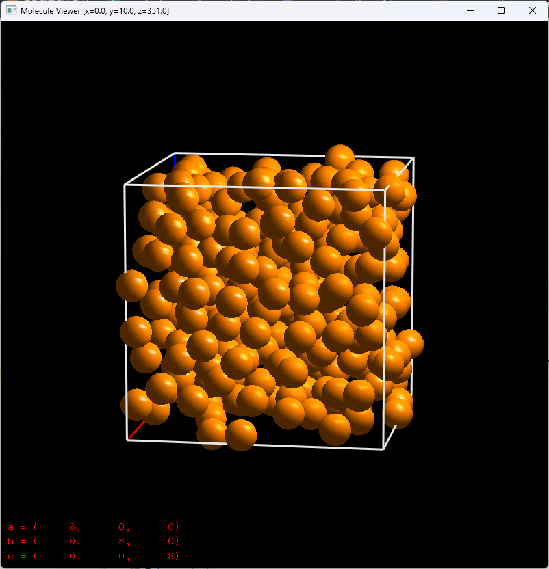
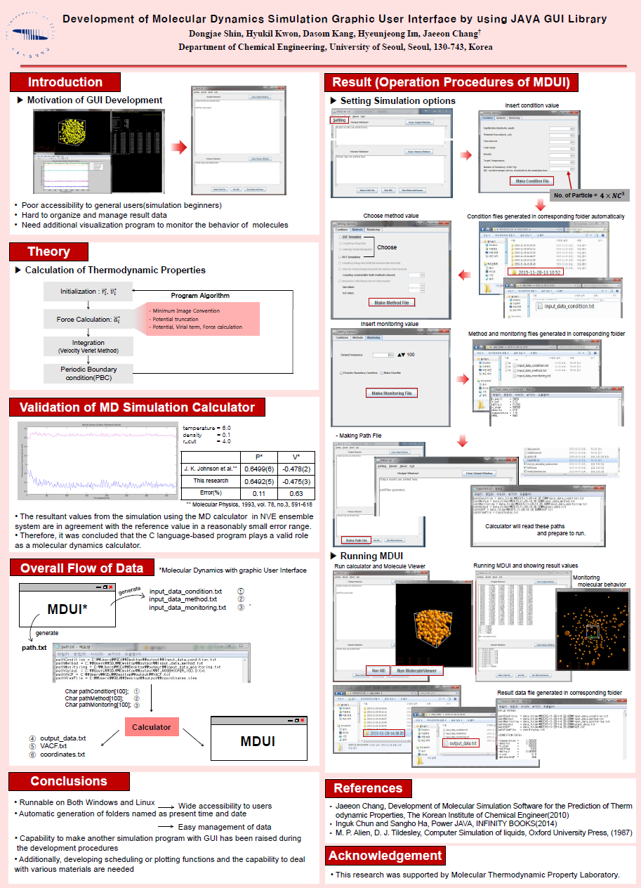

# MDUI
From-scratch molecular dynamics (MD) code (C language) and graphic user interface (GUI) (Java) for study. Only binary files are included here.

- `MDUI.exe` (Java), `md_my_simulation_autocorr.exe` (C): Made with C and Java by Dongjae Shin, Department of Chemical Engineering, University of Seoul  
  
  
 

  
- `MoleculeViewer.exe` (C++): Made with C++ by Sangwon Lee, Department of Chemical Engineering, University of Seoul  

  
 

# Poster for MDUI

 

